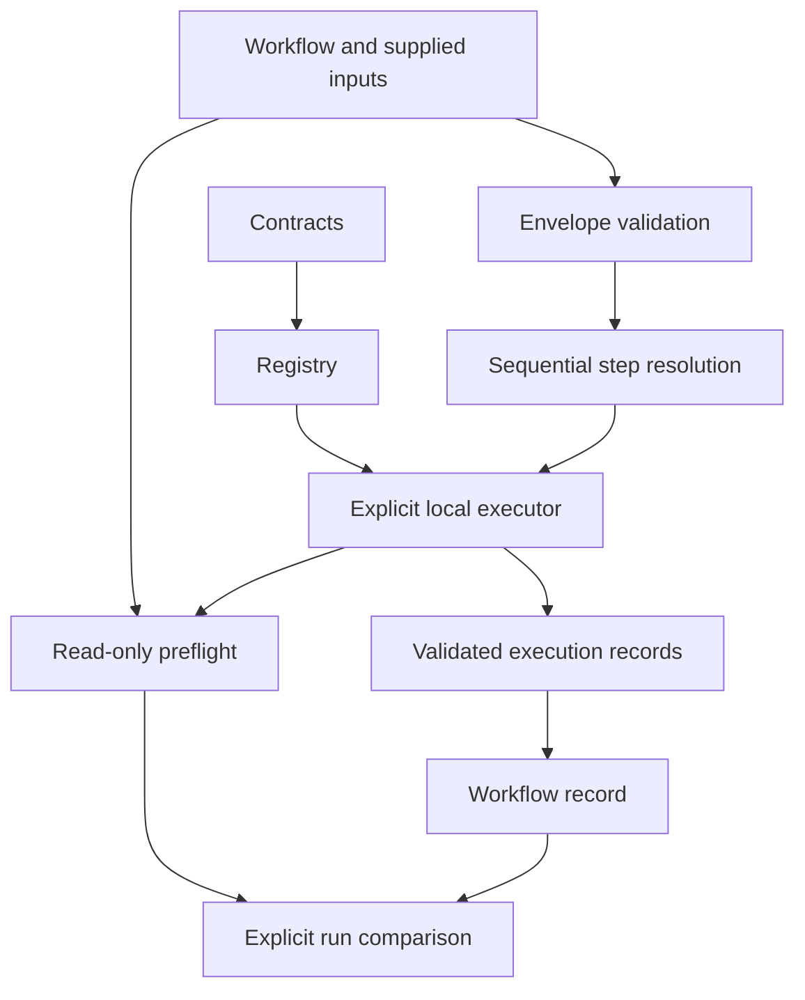

# Current architecture and public contract

This is the current implementation reference after Labs 001–006 and the architecture-review fixes. The [principles](principles.md) remain governing constraints. ADRs record why decisions changed; lab results preserve experimental history rather than defining the current API independently.

## Implemented boundary

Alaetheia is presently a deterministic, single-process laboratory for trusted local functions. It provides typed contracts, a process-local registry, explicit bindings, sequential workflows, advisory preflight, domain rejection, and per-run observations. It does not yet implement a reasoning supervisor or demonstrate the single-supervisor hypothesis.

Preflight reads executor selection state without invoking code. It is not an authorization or execution gate.

## Contract and identity rules

- Capability ID plus contract version describes the operation independently of provider identity. Release-only MAJOR.MINOR.PATCH versions use numeric ordering; prerelease/build suffixes are rejected.
- Offer keys contain provider, implementation, capability ID, and contract version. Implementation version is separate. Duplicate keys and conflicting simultaneous schemas for the same capability/version are rejected.
- Bindings pin full manifests. Missing, unbound, incompatible, or stale offers fail selection. This pins a declaration, not executable code identity or purity.
- Workflow definitions contain exact offers, requirements, typed workflow inputs, and named step input sources: literals, workflow inputs, or earlier declared outputs. No implicit selection or whole-record forwarding occurs.

| Check | Meaning |
| --- | --- |
| Requirement-to-offer inputs | Exact field-name/type/requiredness shape when supplied |
| Requirement-to-offer outputs | Required consumer fields must be guaranteed; exact field types; extra provider fields allowed |
| Handoff preflight | Equal types and INTEGER→NUMBER are safe; NUMBER→INTEGER is conditional; disjoint types are errors |
| Runtime scalar validation | Actual builtin values checked without coercion; NUMBER accepts int or finite float, excluding bool |
| Domain validation | Provider-defined semantic rules; typed rejection is separate from exceptions |

Optional means absence allowed, not null. Every explicit reference must resolve, even if its destination is optional. Schema types remain flat: string, boolean, integer, number. Nested extra output data does not introduce nested typed schemas.

## Supported output-value contract (library 0.2.0)

A successful provider output must be an exact builtin dict with exact builtin str keys. Recursively, its values may contain:

- `None`, builtin str, bool, int, or finite float;
- builtin list of supported values;
- builtin dict with string keys and supported values.

Custom classes, subclasses of builtin types, tuples, sets, bytes, callables, nonfinite floats, cycles, and nesting beyond 64 container levels are rejected as invalid output. The top-level dictionary counts as the first container level. Shared acyclic containers are accepted and copied independently. Integers retain Python precision; no cross-language numeric-range or wire-format guarantee is made.

Snapshotting traverses only these builtin values. It does not call provider-defined copy or serialization hooks. The detached snapshot is then validated against both the complete provider output schema and the consumer's requested output schema. That exact validated snapshot is returned in the successful record. No provider-owned mutable container is retained.

Extra fields remain allowed and retained, but must obey this data vocabulary. `None` is allowed inside untyped extras; it remains invalid for declared scalar fields. Arbitrary copyable Python objects accepted by the earlier lab implementation are no longer supported. This deliberate narrowing is recorded in [ADR-008](decisions/ADR-008-output-data-and-review-hardening.md) and library version 0.2.0. It does not change capability field schemas or add coercion.

An explicit DomainRejection is a separate allowed provider result, not successful output data. It contains a nonempty tuple of typed issues with code, message, and optional input field. Success snapshot restrictions do not convert rejections into dictionaries.

## Outcomes and records

| Execution outcome | Meaning |
| --- | --- |
| success | Selected function returned a valid detached output snapshot |
| selection_rejected | Offer/binding/requirement check failed before invocation |
| invalid_input | Actual step inputs failed validation before invocation |
| domain_rejected | Invoked provider returned structured expected domain issues |
| provider_failure | Invoked provider raised an ordinary exception |
| invalid_output | Returned success data or domain issue references violated the result contract |

An exception message that cannot be formatted gets a stable fallback preserving its original class. KeyboardInterrupt/SystemExit still propagate. Declared purity does not constrain arbitrary in-process Python behavior, and there is no deadline or cancellation mechanism.

Workflow outcomes are success, failed, or invalid_input. Invalid workflow envelopes skip every step before any invocation. Other failures stop at the failing step and skip all later steps. Records preserve inputs, selected manifests and versions, outputs, domain issues, diagnostics, and omission evidence where applicable. Dependency-resolution failures have no fabricated ExecutionRecord.

Payload snapshots are detached but caller-editable; these are inspection records, not tamper-proof audit records. There are no persistent IDs, timestamps, registry snapshots, storage, retries, defaults, or automatic recovery.

## Preflight and observation

Preflight reports errors, risks, or no_detected_issues for the definition and current catalog/bindings. Optional references warn; it never invokes, repairs, or blocks. A clear report cannot predict domain rejection, provider faults, or violation of a promised output.

Run comparison is an explicit local action. It requires equal workflow definitions, but does not guarantee the same registry revision. Missing-output events distinguish required provider omissions from absent optional references. Skipped consumers are not counted again. Domain rejection deliberately has no successful output and generates no missing-output event.

## Implementation map

| Module | Responsibility |
| --- | --- |
| contracts.py / registry.py | Declarations, discovery, requirement compatibility |
| domain.py | Typed expected rejection |
| output_values.py | Data-only output snapshots |
| execution.py | Shared selection checks, invocation, validation, records |
| workflow.py | Typed definitions, envelope checks, sequential composition |
| preflight.py | Advisory analysis and explicit run comparison |
| cli.py | Sample catalog inspection only |
| *_example.py | Explicit local demonstrations, not generic external protocols |

## Validation and development

The full standard-library suite is run with `python -m unittest discover -s tests -v`. CI installs the package and runs it on Python 3.12, 3.13, and 3.14 on GitHub-hosted Ubuntu for pushes and pull requests, with manual dispatch also available. CI additionally compiles sources/tests and smoke-tests the installed CLI. See [tests.yml](../../.github/workflows/tests.yml).

The configured matrix is the explicit CI target, not evidence that a particular remote run has already passed. There is no static type checker configured, and compilation does not establish type correctness. No branch-protection rules are changed by adding the workflow.

## Horizons and supersession

Labs 001–006 and review consolidation are implemented. Lab 007, LLM selection, supervisors, dynamic planning, external providers, side effects, persistence, agents, distributed infrastructure, and web UI remain unimplemented and unauthorized by this reference.

- ADR-002 supersedes the initial exact-output matching choice.
- ADR-003's invocation design is implemented by Lab 002; its original deferred status was historical.
- ADR-004's workflow design is extended by ADR-005 preflight and ADR-006 reusable inputs.
- ADR-007 supersedes ADR-006's exception-based parcel-domain rejection; validator contract is 2.0.0.
- ADR-008 supersedes arbitrary Python extra-output snapshots from the early invocation lab.

Consult the [architecture checkpoint](reviews/2026-09-22-architecture-review.md) for evidence and proposed next experiments. Proposals there are not new implementation authorization.
