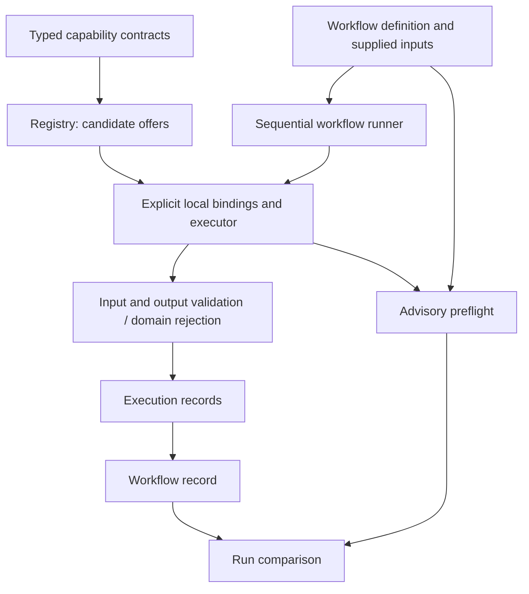

# Architecture checkpoint after Labs 001–006

- **Date:** 2026-09-22
- **Reviewed revision:** `f3d4d3f7a6bf4746e23696d748c112824f125c82` (merged Lab 006)
- **Status:** Review and recommendations, not an implementation ADR or authorization for Lab 007
- **Method:** Read implementation, architectural decisions, lab documentation, and behavior tests; run the complete suite and targeted edge-case probes. No application code changed during this review.

## Assessment

The architecture is coherent for its stated laboratory scope: a small deterministic engine for declaring, discovering, invoking, and composing trusted local functions. The separation of capability identity, provider identity, explicit execution, workflow wiring, preflight, and observations has survived six increments without a framework, database, or additional reasoning agent.

The evidence supports continuing this foundation, not replacing it. It does not establish the central supervisor hypothesis yet. Every provider choice, workflow, and domain rule is authored by a developer; no experiment has measured goal interpretation, autonomous selection, planning, evidence acquisition, or the value of another agent.

Recommended sequence: fix the concrete defects below and consolidate the public contract, then evaluate bounded proposal-only selection among predefined workflows. Avoid another open-ended sequence of generic workflow features unless a task requires them. No implementation is performed by this review.

## Verified defects

Priorities here are scoped to the current local laboratory. No P0/P1 defect was established. These are not claims that the code is safe for untrusted execution.

### F1 — P2: Exception formatting can escape the failure boundary

**Location:** [execution.py](../../../src/alaetheia/execution.py), lines 140–145.

The provider call is caught, but `str(error)` is executed in the handler without a fallback. A provider exception whose `__str__` raises escapes `invoke` as a new exception. The workflow then cannot return its promised failed/skipped records. The probe produces `RuntimeError: exception formatting failed` instead of a provider_failure record.

**Fix direction:** Safely format ordinary exceptions with a stable fallback containing the original exception class. Preserve the explicit policy for KeyboardInterrupt/SystemExit. Test both direct invocation and workflow fail-fast behavior when formatting fails. This is an exception-reporting robustness defect, not a request to swallow all errors everywhere.

### F2 — P2: Snapshotting can invalidate output after validation

**Location:** [execution.py](../../../src/alaetheia/execution.py), lines 159–180.

Declared output is validated before `deepcopy`. Extra outputs may contain arbitrary Python objects, and copying can invoke their custom hooks. The probe's extra object changes the copied `count` field to a string. The result still reports success, even though validating its recorded output produces `'count': expected integer`.

**Fix direction:** Define the allowed extra-value/snapshot contract and validate the actual snapshot used as the successful result. Consider limiting extras to explicitly supported data values rather than arbitrary executable Python copy behavior. Changing the allowed value vocabulary requires a documented compatibility decision. Revalidation alone does not establish isolation against all custom copy hooks.

**Scope:** This is an edge case involving a custom object, not a failure observed in the scalar examples. Trusted code is still trusted; this finding does not imply that deepcopy or the executor can become a security sandbox. It demonstrates a gap in the claimed successful-record invariant.

### F3 — P3: Empty CLI version arguments silently broaden discovery

**Location:** [cli.py](../../../src/alaetheia/cli.py), lines 28–32.

Both `--version ''` and `--range ''` are treated as if the argument were absent because selection uses truthiness. Each exits 0 and returns all five slope offers, including version 3.0.0. This contradicts the explicit rejection of empty version/range strings in the parsers and the CLI's invalid-input contract.

**Fix direction:** Distinguish absence (`None`) from supplied empty text and use an explicit mutually exclusive argument group. Add CLI cases for empty values and simultaneous flags with one empty value.

### Reproduction evidence and disposition

The original probes reproduced F1–F3 at the reviewed revision. During the subsequently authorized consolidation, their broken-behavior assertions were retired and replaced with [regression tests](../../../tests/test_architecture_consolidation.py). See [ADR-008](../decisions/ADR-008-output-data-and-review-hardening.md) and the [current reference](../current.md) for the fixes. Findings and assessment above remain a historical account of the reviewed revision.

## Architecture as implemented

Preflight only reads selection/declaration state. The diagram does not imply that it invokes providers or gates the runner. Runtime checks remain authoritative.

| Boundary | Assessment | Limits to preserve or address |
| --- | --- | --- |
| Contracts and registry | Clear, deterministic, independent of provider identity | Shape equality cannot establish meaning or enforce correct version evolution |
| Local bindings and executor | Explicit authority from trusted caller code; stale manifests rejected | Manifest equality pins a declaration, not a code hash or proof of function behavior |
| Input validation | Entire workflow envelope validated before calls; per-step validation retained | Flat scalar types; domain rules stay in functions |
| Output compatibility | Consumer minimum needs separated from complete provider promises | Extra value vocabulary is too broad for strong snapshot/serialization guarantees |
| Workflow composition | Ordered, explicit, fail-fast; no accidental planning | Optional references fail if absent, even for optional destinations; intentional policy |
| Preflight | Read-only, deterministic, shares executor selection checks | Reports describe current declarations; no reservation or registry snapshot |
| Domain rejection | Expected data problems separated from exceptions and invalid success output | Codes are provider-owned and not declared in manifests; conscious ADR-007 choice |
| Observation | Records explain selected offers, values, issues, and skipped steps | Mutable payload snapshots, no run IDs/timestamps, no persistence or tamper resistance |

The import dependency structure is small and understandable: contracts underpin registry/domain; executor uses them; workflow uses executor; preflight reads workflow/executor records. Preflight also houses run comparison, a second responsibility that may deserve a separate module when observation evolves. It does not justify a framework today.

## What the labs establish—and what they do not

| Lab | Supported by tests/examples | Still unproven |
| --- | --- | --- |
| 001: discovery | Overlapping offers survive exact lookup, filters, and explicit version constraints | Semantic search, ranking, provider equivalence, semantic version compliance |
| 002: invocation | Explicit local binding, payload validation, records and failure categories | Remote providers, isolation, deadlines, cancellation, production authorization |
| 003: composition | Explicit dependencies and deterministic failure propagation | Dynamic plans, general scheduling, resume, side-effect compensation |
| 004: preflight | Declared risks/errors can be compared with actual runs | Real-world prediction rates, report reuse across changing environments |
| 005: reuse | One workflow can process varied supplied records with input isolation | Workflow version governance, business utility, external fact verification |
| 006: domain outcomes | Typed expected rejection differs from provider malfunction | Standard issue catalogs, recovery policy, semantic correctness of rejections |

The 86 passing tests establish behavior under the tested cases, not production reliability or the adequacy of a single supervisor. There is currently no implemented supervisor to compare against a multi-agent alternative.

## Important design questions, not current defects

### 1. The contract has several distinct meanings

The system correctly distinguishes capability requirement matching, edge value compatibility, runtime shape validation, and domain validation. Those must remain distinct. For example, INTEGER and NUMBER declarations need not match an exact requirement, while an integer value can safely feed a NUMBER input. Consolidate these rules in one current contract reference with examples and a shared test matrix; do not collapse them into one permissive matcher.

Schemas currently express names, scalar types, requiredness, and explanatory prose. Units, coordinate systems, identifiers' namespaces, and semantic promises are not mechanically checked. A domain rejection protocol does not solve that. Add structured domain semantics only when a concrete contract needs them.

### 2. Version and implementation identity are only partly governed

Contract and implementation versions are separated appropriately. Workflow IDs have no version; issue meanings are not a declared catalog; package metadata still says 0.1.0 and describes the initial registry. Registry consistency applies to simultaneously registered shapes, not historical identity: removing every offer erases its shape history. These are acceptable in a process-local lab but insufficient for independently deployed producers/consumers.

Before external distribution, define which changes alter the library protocol, workflow identity, contract version, and implementation version. Do not make an agent registry or database just to solve this prematurely.

### 3. Failure records are useful but not uniformly structured

Domain issues and missing-output evidence are structured. Most input errors, selection errors, and binding-resolution errors are strings. RunComparison exposes the failed invocation category, but failures before invocation can have no invocation outcome and require examining the underlying record.

This is adequate for human inspection. Before machine-driven selection or recovery, define a small stable diagnostic vocabulary with stage, code, and location. Keep messages descriptive. Avoid adding overlapping statuses at every layer unless a consumer needs them. A failed workflow with a domain_rejected step is not inherently wrong.

Record dataclasses allow callers to construct inconsistent combinations, and payload dictionaries are deliberately editable. `compare_run` assumes genuine internally produced records. These are documented local API assumptions, not durable audit guarantees. An external record loader would need explicit validation rather than direct dataclass construction.

### 4. Preflight and observation are intentionally not enforcement

A clear report can precede a stale binding, provider exception, domain rejection, or omitted required output. All are correctly caught later. Do not promote a preflight status to execution permission.

Comparisons check workflow-definition equality, not registry revision or run identity. Optional warning attribution therefore reflects the supplied report, not a guaranteed same-environment prediction. Fine for the current examples; a future evaluator should retain the compared catalog/binding manifest snapshot or otherwise record which environment was inspected.

Missing-output observation counts different units: one event per absent required provider field, versus one per consumer binding that fails to resolve. Do not turn these into an aggregate failure percentage without defining denominators, reachability, and skipped cases. No operational incident rate has been measured.

### 5. The trust boundary must stay explicit

The current callable is trusted Python code with the process's privileges. Declared permissions/effects restrict example registration but do not enforce purity. The executor is synchronous, has no deadline, and can hang on a provider that does not return. Those are accepted exclusions for local pure experiments; they become required design work before remote, untrusted, or side-effecting providers.

Model-generated choices would be untrusted input even if the functions remain trusted. Introduce a small validated data proposal boundary; never evaluate generated Python, import generated callable paths, or treat metadata as authorization. This is a future design recommendation, not an implementation added by this review.

## Documentation and engineering consistency

The README tracks later labs, but `vision.md` and the conceptual-model horizon still emphasize the original Lab 001 NOW/NEXT split. ADR-003 still says implementation deferred, and ADR-006's exception-based domain rule has been superseded by ADR-007 without an explicit status cross-reference. The README's Lab 002 outcome list omits domain_rejected. AGENTS.md accumulates historical authorization notes rather than presenting one current boundary.

Preserve history, but add a concise current architecture index and mark superseded decisions explicitly. A reader should not have to replay six lab writeups to identify today's invocation protocol. These are handoff-maintenance issues, not evidence that the implementation violated the agreed architecture.

The repository has meaningful parameterized behavior and subprocess tests. No checked-in CI configuration or static type-check configuration was found. Type annotations alone do not establish static type correctness: for example, provider inputs are annotated as Mapping[str, object] and consumed with string/number operations after runtime checks, which a type checker cannot infer across the invocation boundary. No type checker was run in this review.

Recommended modest improvements: run the existing suite automatically on PRs, choose and document a supported Python test matrix, and add a deliberately scoped static check with proper narrowing at dynamic boundaries. Do not claim coverage percentages; none were measured. Formal public serialization is also absent—the demonstration JSON formats are examples, not a supported remote protocol.

## What to keep unchanged now

- One future reasoning supervisor remains the default hypothesis; no evidence warrants additional agents.
- Explicit provider selection and capability/provider identity separation.
- Advisory preflight plus mandatory runtime validation.
- Fail-fast sequential workflows and explicit absent-reference failures.
- Expected domain rejection separate from exceptions and output violations.
- Local trusted examples; no network, persistence, branching, retries, automatic defaults, or infrastructure expansion without a concrete need.

## Recommended next sequence

### First: consolidation and fixes, not another feature experiment

Fix F1–F3 with regression tests. Decide a defensible output snapshot vocabulary, document the current public outcome contract, refresh supersession links/current architecture, and automate existing checks. Keep this bounded; no general refactor or framework migration is justified.

Acceptance: the current suite plus focused new regressions passes; ordinary provider failures always produce records even when formatting fails; a successful record's stored declared fields validate; empty version arguments fail clearly; a new reader can find the current API/boundaries in one place.

### Then: candidate Lab 007—proposal-only selection evaluation

Choose a small catalog of predefined pure local workflows and a fixed collection of user requests with reviewed expected selections, required inputs, and cases that should abstain. Establish the deterministic baseline first. Compare it with a bounded model that proposes an existing workflow ID and inputs (or abstains). Validate proposals as data and inspect them; do not execute model proposals automatically during the first experiment.

Measure exact selection, invalid/unknown IDs, schema validity, abstention on ambiguous or unsupported requests, and the amount of human correction required. If a live model is later authorized, record its model/prompt versions and cost/latency as measurements, not assumptions. Commit to criteria before collecting outcomes. Do not authorize or implement any model integration through this review.

This would finally test a reasoning boundary relevant to the vision without simultaneously adding dynamic planning, external providers, side effects, or multi-agent complexity. It can reveal whether we actually need broader workflow machinery.

### Alternatives and reasons to defer

| Option | Value | Why not the immediate next build |
| --- | --- | --- |
| Branching/defaults/retries | Could accommodate optional information and recovery | Current synthetic cases do not establish the desired policy |
| External parcel-data provider | Introduces real provenance and useful domain work | Adds network failure, credentials, data licensing/meaning, and authority at once |
| Persistent execution ledger | Cross-run traceability and retention | No current resume or retention requirement; local evaluation can precede storage architecture |
| Multi-agent system | Potential independent reasoning boundaries | No measured single-supervisor baseline or demonstrated need |

## Verification and review limits

- Reviewed merged HEAD `f3d4d3f` under Python 3.12.10.
- Complete unittest suite: **86 methods passed**, including subprocess tests and parameterized cases.
- Source/test compilation and tracked whitespace checks passed.
- Targeted probes reproduced F1–F3 (the CLI issue was checked for both flags).
- No application files modified, fixes applied, PR opened, or new lab implemented.
- This is a source/design review with local behavioral checks, not a security audit, load test, static-analysis certification, or real-world domain validation.
